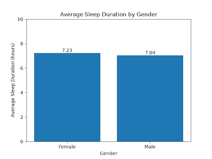
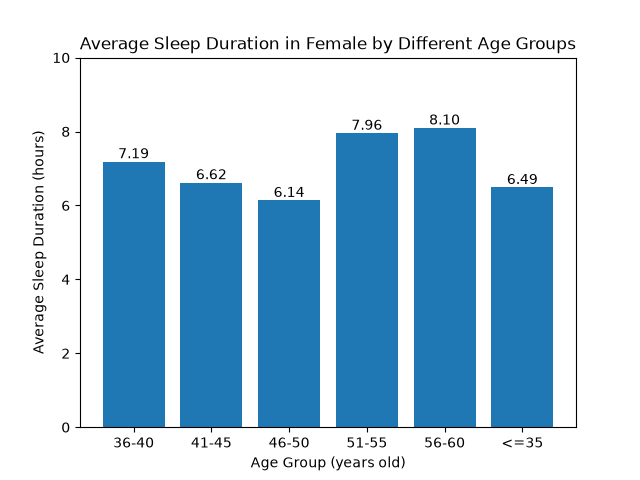
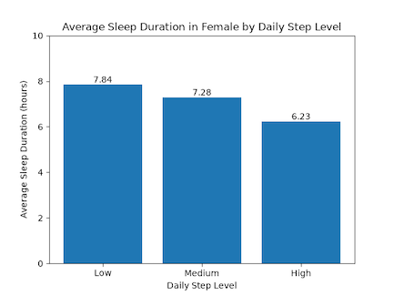
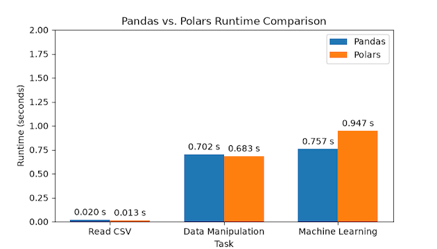
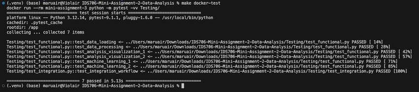
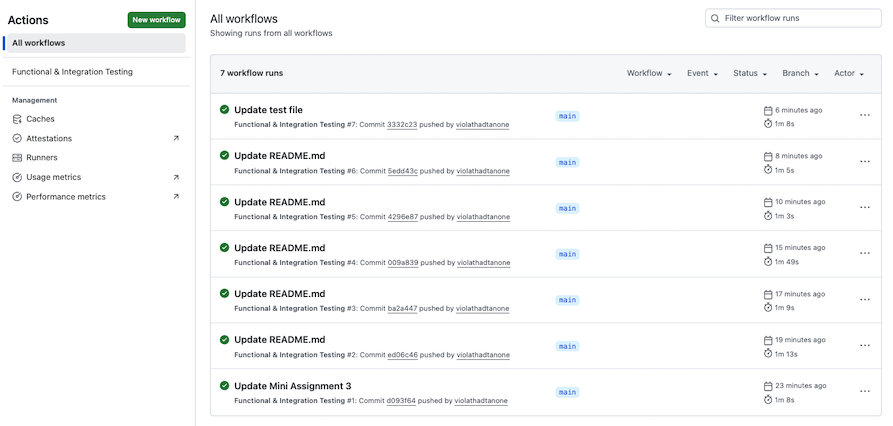
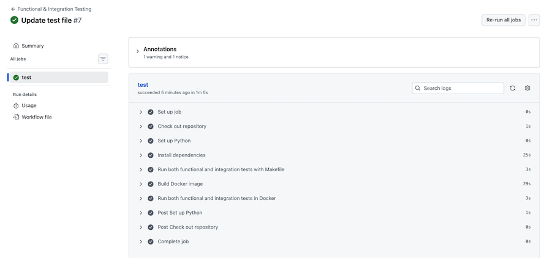

[](https://github.com/violathadtanone/IDS706-Mini-Assignment-2-3-Sleep-Data/actions/workflows/test.yml)

# IDS 706 Mini Assignment : Sleep Data Analysis - 22 Sep 2026

## Project Description
This repository consolidates 2nd and 3rd mini assignment under IDS 706 as part of the 3-week project.

- 2nd Mini Assignment - Start Your First Data Analysis: The first part covers the usage of pandas and polars with common data manipulation and visualisation. The latter part of this assignment covers experimentation with Rust on Jupyter notebook from the provided Rust template.
- 3rd Mini Assignment - Testing and Reproducibility: This is for practicing the creation of functional and integration test cases and setting up a GitHub Actions workflow as an enhancement of those in 2nd Mini Assignment, especially on the analysis using Pandas.


## Project Structure 
```bash
IDS706-Mini-Assignment-2-3-Sleep-Data
├── requirements.txt                        # List of packages required for installation
├── analysis_query.ipynb                    # Jupyter Notebook for Data Analysis
├── Sleep_health_and_lifestyle_dataset.csv  # Dataset required for Data Analysis
├── Testing/                   
│   ├── test_functional.py                  # Functional test command
│   ├── test_integration.py                 # Integration test - End to end workflow run
├── Makefile                                # Create shortcut to all common command for the development
├── Dockerfile                              # Docker container to package everything we built
├── .github/                   
│   ├── workflows        
│       ├── test.yml                        # GitHub Actions workflow
├── Images/                                 # Images used for supporting README.md explanation
├── Rust Experience/                        # Jupyter Notebook for Rust Exploration based on the provide template
└── README.md                               # Project documentation
```

## Dataset Description 
The dataset uses for this assignment is Sleep_health_and_lifestyle_dataset.csv from Kaggle. It includes a wide range of variables related to sleep and daily habits such as gender, age, occupation, sleep duration, quality of sleep, and the presence or absence of sleep disorders. It can be download from: https://www.kaggle.com/datasets/uom190346a/sleep-health-and-lifestyle-dataset


## Overall Setup Instructions
### 1. Creat GitHub repository
General:
- Name the repository with `IDS706-Mini-Assignment-2-3-Sleep-Data`.

Configuration:
- Add README - Toggle On option.
- Add .gitignore - Select Python.
- Proceed to create repository.

### 2. Clone repository in VS Code
- Open Command Palette and select `Git: Clone`.
- Paste GitHub repository URL (e.g. https://github.com/violathadtanone/IDS706-Mini-Assignment-2-3-Sleep-Data).
- Select the local folder to continue the development.

### 3. Set up a Python virtual environment
- Create and activate the virtual environment on Terminal with the code below:
```bash
python -m venv .venv
source .venv/bin/activate
```
- Upgrade pip to ensure that it is compatible with the current Python version before installing other packages. We also include upgrade `ipykernel` since it is key for the assignment.
```bash
python -m pip install --upgrade pip
python -m pip install --upgrade ipykernel
```

### 4. Create requirement file for project dependencies (e.g. python packages required)
- Create a new file called `requirements.text` in the project root and add packages below in the file.
```
pytest
pandas
polars
scikit-learn
matplotlib
```
- Install the requirements in the visual environment `(.venv) (base)` with the code below in Terminal:
```bash
python -m pip install -r requirements.txt
```

- Verify that `pytest` is installed for the functional tests. This should return with pytest version number on Terminal. This can also be done with other packages mentioned in the requirements.
```bash
pytest --version
```
<br><br>

## Setting up Pandas and Polars
### 1. Create new Jupyter Notebook file
- Create a new file called `analysis_query.ipynb`

### 2. Import required library
- In `analysis_query.ipynb`, use the code below to import the installed packages during setup.
```python
import pandas as pd
import polars as pl
import numpy as np
from sklearn.model_selection import train_test_split
from sklearn.linear_model import LinearRegression
from sklearn.tree import DecisionTreeRegressor
from sklearn.ensemble import RandomForestRegressor, GradientBoostingRegressor
from sklearn.metrics import mean_squared_error, r2_score, accuracy_score, classification_report
import matplotlib.pyplot as plt
import time
```
- Check whether the packages for pandas, polars and numpy have been properly imported into the enviroment. This should return the version number.
 ```python
print(pd.__version__)
print(pl.__version__)
print(np.__version__)
```

### 3. Import dataset
- Add the dataset `Sleep_health_and_lifestyle_dataset.csv` into the project root and import the dataset into `analysis_query.ipynb` using the code below:
```python
sleep_data = pd.read_csv('Sleep_health_and_lifestyle_dataset.csv')
```
<br><br>

## Setting up Rust
### 1. Install Rust and validate
- Use the code below in Terminal. This should return the version number for sucessful installation.
 ```bash
curl --proto '=https' --tlsv1.2 -sSf https://sh.rustup.rs | sh
rustc --version
cargo --version
```

### 2. Rust Jupyter kernel
- Upon successful installation of the code below in terminal, this should return as "Installation complete".
 ```bash
cargo install evcxr_jupyter
evcxr_jupyter --install
```
- Select `Rust` as the kernel. If this does not appear, save the existing works and `⌘ + SHIFT + P` then choose `> Developer: Reload Window`.
<br><br>

## Setting up Testing

### 1. Create functional and integration file for further update
- Create the folder name `tests` in the project root. This is the folder to store all the test files.
- Create new files called `test_functional.py` and `test_integration.py` under this folder. Further details to be discussed in the next section.

### 2. Create a Makefile
- Create a new file called `Makefile` in the project root with the code below. The file should have Orange icon.
```
.PHONY: install test run docker-build docker-run docker-test clean

IMAGE_NAME := mini-assignment-3

# Install dependencies
install:
	python -m pip install -r requirements.txt

# Run tests from Testing folder
test:
	python -m pytest -vv Testing/

# Build the Docker image
docker-build:
	docker build -t $(IMAGE_NAME) .

# Run the test suite from Testing folder inside Docker
docker-test:
	docker run --rm $(IMAGE_NAME) python -m pytest -vv Testing/

# Clean generated files
clean:
	rm -rf __pycache__
	rm -rf .pytest_cache
```

### 3. Run the project with Docker
- Install and open Docker Destop.
- Verify that Docker is installed. This should return with Docker version number on Terminal.
```bash
docker --version
```
- Create a new file called `Dockerfile` in the project root and include the code below. The file should have Docker icon.
```
FROM python:3.12-slim

WORKDIR /app

COPY requirements.txt .
RUN pip install --no-cache-dir -r requirements.txt

COPY Sleep_health_and_lifestyle_dataset.csv .
COPY Testing ./Testing

CMD ["python", "-m", "pytest", "-vv"]
```

- Create a another file called `.dockerignore` in the project root and include the code below. This summarises all the files to be ignored by Docker.
```
.venv
__pycache__
.pytest_cache
.git
.github
```

- Build the image using Docker related shortcut from `Makefile` with the code below in Terminal:
```bash
make docker-build
```
<br><br>

## Key Highlights from Data Analysis Results
- Further details of analysis conducted can be found in https://github.com/violathadtanone/IDS706-Mini-Assignment-2-3-Sleep-Data/blob/main/analysis_query.ipynb

### Gender vs Sleep Duration

- In our small samples of 374 observations, we found that female individuals on average slept slightly longer than male, which aligned with the existing US-based research (see https://pmc.ncbi.nlm.nih.gov/articles/PMC4164903/).
- It appeared that female from our dataset slept around 7.23 hours per day, while it was around 7.04 hours per day for male. 
- Because the dataset does not provide sufficient information on the participants’ health status, it is also difficult to determine whether the observed difference in sleep duration is associated with gender or other underlying characteristics.



### Sleep Duration in Female
- To further explore this pattern, we created a subset containing only 185 women to examine whether the relationships observed in the overall dataset persisted within the female group.
- For `'Age'`, the dataset showed a clear trend that female participants between 51 and 60 years old tended to sleep longer.

- For `'Daily Step Level'`, it has been initially hypothesized that the more steps female take per day, the longer her daily sleep duration. Nevertheless, the barchart diagram came back with surprising results, where female individuals with lower daily steps tended to have longer duration of sleep at 7.84 hours. Hence we proceeded to perform multiple regression models to understand further of such perplex relationship.

<p align="center">
  
  
</p>

### Machine Learning Results
- Machine learning was used to explore a relationship between `'Daily Steps'` and `'Sleep Duration'`, where tree-based models demonstrated good performance as compared to basic linear regression.
- The model was later improved by adding `'Age'` variable and incorporating Gradient Boosting Model, which works well with non-linear model. 
- The final results showed that all three models perform well, with Random Forest performing best (R² = 0.919, RMSE = 0.225), indicating slightly higher predictive accuracy than Gradient Boosting and Decision Tree.
- Adding 'Age' substantially improved model performance. For Decision Tree model, R² increased from 0.74 to 0.91, while RMSE decreased from 0.45 to 0.23, while for Random Forest model, R² increased from 0.71 to 0.92, while RMSE decreased from 0.47 to 0.23. 


## Pandas vs Polars Performance
- Polars was slightly faster than Pandas for the data analysis section (0.68s vs. 0.7s), but slower for the machine learning section (0.95s vs. 0.76s).
- Overall, this partially aligned with the general consensus that Polars can outperform Pandas, particularly for data manipulation, but Polars’ performance depends on the type of task, and it may not be faster when using tools like scikit-learn.


<br><br>

## Rust Exploration
- Further details on experimentation with Rust can be found from https://github.com/violathadtanone/IDS706-Mini-Assignment-2-3-Sleep-Data/blob/main/Rust%20Experience/rust_vs_python_intro.ipynb
<br><br>

## Functional Test
Once we created `test_functional.py` during setup, functional test cases can be included across the following framework:
### 1. Data loading
- Dataset is loaded as a DataFrame
- Dataset is not empty
- There are 374 rows and 13 columns
- Expected columns are presented
- No duplication in Person ID

### 2. Data preprocessing and transformation
- Dataset contains only female observations
- Subset data for female is not empty
- Age Group variable is created
- Age Group contains only expected categories
- Daily Step Level variable is created
- Daily Step Level contains only expected categories

### 3. Data Visualization
- Categorical variables are as expected
- Mean Sleep Duration values are valid and within the expected range of 0–10 hours

### 4. Machine learning model training, prediction and evaluation
- Model predictions are valid, finite, and match the test dataset size
- Model evaluation and visualization data are valid, with finite R²/RMSE values and the expected structure
- Test Sleep Duration values and the perfect prediction line have a valid range
<br><br>

## Integration Test
Instead of treating each function separately, we check that the entire workflow in a single test to validate the interaction between each components. This includes: 
- Data loading
- Data preprocessing and transformation → Using raw data from data loading
- Machine learning model training → Using preprocessing data
- Machine learning model prediction and evaluation → Using train and test data
- Data visualization → Using machine learning results 
<br><br>

## Test Execution & Results
### 1. Run the test from python file
- Run the code below in Terminal with `test_main.py` to see perform the test with details. Test results will be indicated here.
```bash
python -m pytest -vv Testing/
```

### 2. Run the test from Makefile
- Run the code below in Terminal. This should return the same results of passing/failing from the previous steps.
```bash
make test
```

### 3. Run the test from Docker
- Run the code below in Terminal. This should return the same results of passing/failing from the previous steps. The screenshot of test results can also be seen below, where all test cases successfully passed.
```bash
make docker-test
```


<br><br>

## CI Workflow
This will allow us to use GitHub Action to automatically run the tests.

### 1. Add GitHub Actions
- Create the folder called `.github` in the project root and create another subfolder called `workflows`.
- Create the file called `test.yml` within `workflows` and include the code below.
```
name: Functional & Integration Testing

# This workflow will automatically run tests on code changes.
on:
  push:
  pull_request:
  workflow_dispatch:

jobs:
  test:
    runs-on: ubuntu-latest

    steps:
      - name: Check out repository
        uses: actions/checkout@v4

      - name: Set up Python
        uses: actions/setup-python@v5
        with:
          python-version: "3.12"

      - name: Install dependencies
        run: make install

      - name: Run both functional and integration tests with Makefile
        run: make test

      - name: Build Docker image
        run: make docker-build

      - name: Run both functional and integration tests in Docker
        run: make docker-test
```

### 2. Validate workflow run
- We can check the successful run of the workflow, where the green icon indicates a complete run, where red icon indicates some failure during the run. The screenshot of CI results can also be seen below, where all workflows successfully ran.

